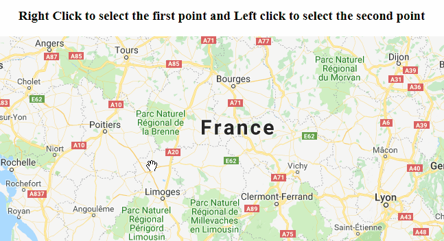
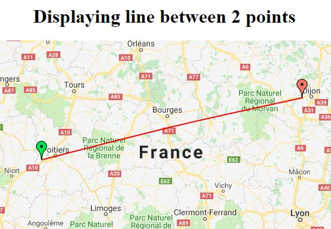

# Google maps
Multiple useful functions for a google map in html using javascript.

## Setup
Please replace the key in the script tag with your own google api key.

  

You can get your own key by following this [link](https://developers.google.com/maps/documentation/javascript/get-api-key)

## Pages
### Putting multiple markers in a map

  

Check code [here](src/put-multiple-marker.html)

### Displaying multiple markers in a map

  

Check code [here](src/display-multiple-markers.html)

### Drawing line between 2 points in a map

  

Check code [here](src/draw-line-between-2-points.html)

### Displaying line between 2 markers in a map

  

Check code [here](src/display-line-between-2-points.html)
